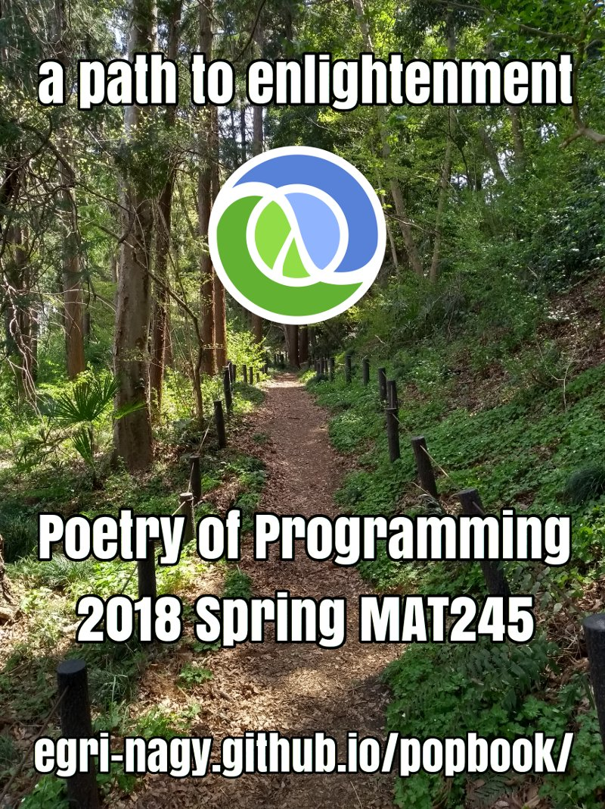
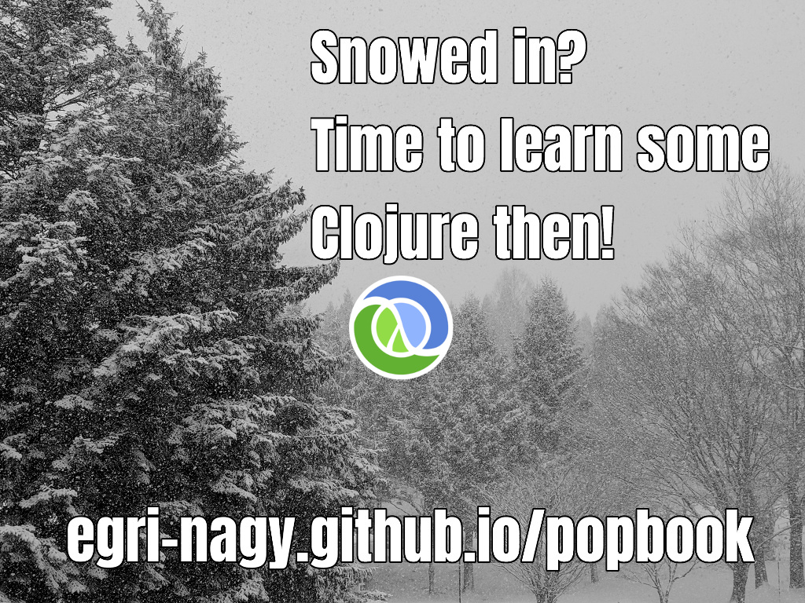
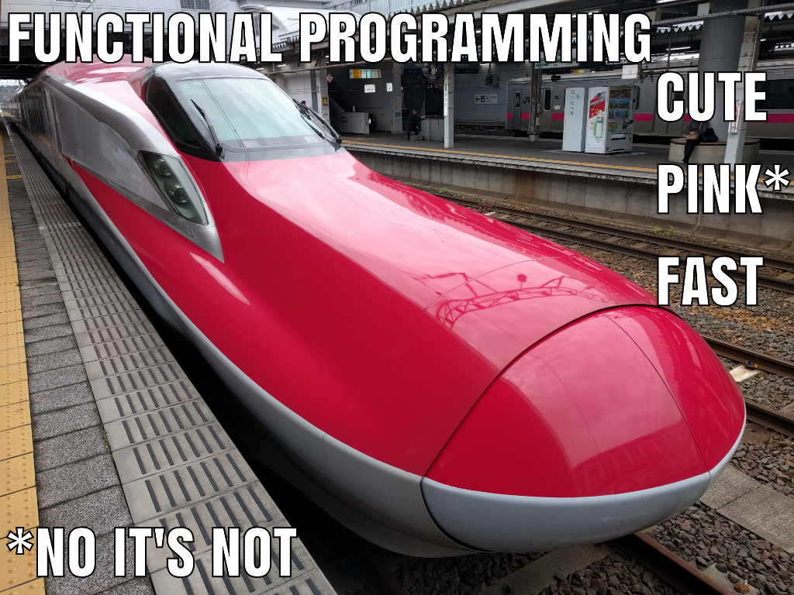

# Poetry of Programming - Puzzle Based Introduction to Functional Programming

This is a [Clojure](http://clojure.org) programming course designed for non-programmers, in particular for Liberal Arts students with some college/high school algebra background. The course discusses the functional core of the language. It is offered at [Akita International University](http://www.aiu.ac.jp) in Japan (MAT245). It is designed for
1. experiencing the joy of computer programming,
2. seeing mathematical ideas in use,
3. getting fundamental and powerful programming skills, that could kickstart a serious IT career.    

FOR STUDENTS:
* [Flyer](PoPflyer.pdf) for advertising the course
* [Syllabus](PoP_syllabus.pdf) detailed description, schedule, assessment, related courses
* [Textbook](PoP.pdf) suitable for self-study
* [How To Code It?](HowToCodeIt.pdf) guidelines for computational problem solving
* [Assignments](problems.md) are for lab work. In case of running out of time, they become homework problems.
* [Reading Exercises](PoP_reading_xs.pdf) are for traditional paper-based exams. The task is to determine what the one-liners evaluate to.
 * [Coding exercises](coding_exercises.pdf) are for practising how to turn ideas into source code. Plans are given, the task is to express them as Clojure code.
* [Extra problems](problems.pdf)
* [Mini-projects](projects.pdf) require a bit more work than exercise problems.

Try the language online: [replumb(cljs)](http://clojurescript.io/) [reepl(cljs)](https://jaredforsyth.com/reepl/) [repl.it(clj)](https://repl.it/languages/clojure)

FOR SOFTWARE ENGINEERS, COMPUTER SCIENCE EDUCATION RESEARCHERS

Conference presentations

* **[2017 Clojure/conj](http://2017.clojure-conj.org/)** [slides](TALKS/2017_Clojure_conj_ENA.pdf), [abstract](http://2017.clojure-conj.org/poetry-of-programming/),  [recorded video](https://www.youtube.com/watch?v=XRjPnuPv6xo).
* **[2018 ClojuTRE](https://clojutre.org/2018/)** [slides](http://egri-nagy.hu/pdf/2018ClojuTREena.pdf), [recorded video](https://youtu.be/-yGHsXSgYdg)

This work is licensed under [CC BY-NC-SA 4.0](https://creativecommons.org/licenses/by-nc-sa/4.0/deed.en).
[Attila Egri-Nagy](http://www.egri-nagy.hu) [@EgriNagy](https://twitter.com/EgriNagy)

# 2018 Spring

# Course Introduction 2017/18 Winter

The purpose of the course is to experience the joy of computer programming. Serious fun that can easily be turned into an important skill in career planning.

# Course Introduction 2017 Spring

This course aims to share the empowering and fun experience of writing computer programs. It is a gentle introduction to functional programming in [Clojure](https://clojure.org/), which is based on very simple mathematical ideas and it is currently gaining widespread adoption in software industry. According to stackoverflow, it also appears to be [well-paid](https://stackoverflow.com/insights/survey/2017#technology-top-paying-technologies-worldwide).

Is this course for you? First of all, you do NOT need any previous programming experience. So if you are interested, then YES.

In particular, Poetry of Programming is for you if you agree with AT LEAST ONE of the following statements.

   1. You like puzzles but you do not find solving equations too exciting (or you do).
   2. You don't like math but you are happy to give it one more chance.
   3.  You like math.
   4. You would like to understand how computers work.
   5.  You like the idea of an intellectual adventure.
   6. You are planning a career in information technology.
   7.  You are concerned about the society in the information age, so you would like to understand computing as one of its driving forces.
   8. You know some other programming language, but want to learn Clojure as well.

Unfortunately, the gender ratio in computing is currently out of balance. There are efforts to get more diversity (see for example [girlswhocode.com](https://girlswhocode.com/about-us/)), so there could be good career opportunities for women in the IT sector. Therefore, female students are particularly recommended to consider this course.

[Original blog entry on how this project started](https://replforce.wordpress.com/2016/10/11/poetry-of-programming/)

